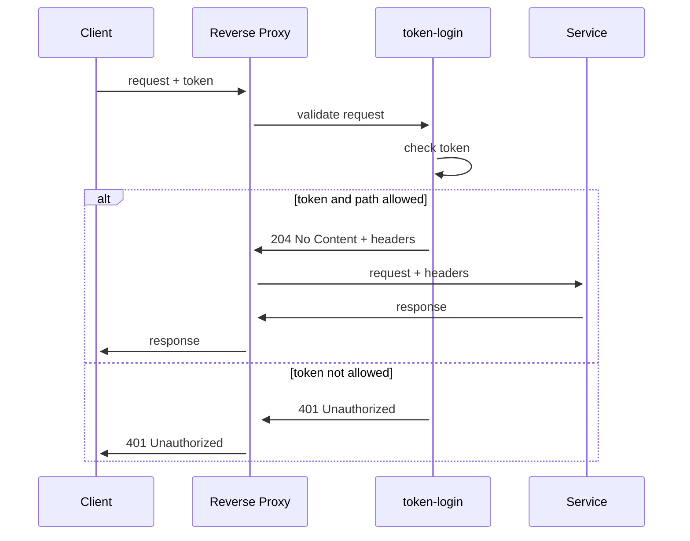

# Token-login


The authorization system based on tokens.

Token-login is a server that functions as a [forward auth](https://doc.traefik.io/traefik/middlewares/http/forwardauth/)
server and provides an authorization flow for requests based
on [API keys](https://swagger.io/docs/specification/authentication/api-keys/).
The server is [designed](#architecture) with security as the top priority and offers a clean administrative UI,
high-performance
validation flow, and various [configuration options](#configuration).

Users can use [pre-built packages](https://github.com/reddec/token-login/releases/latest) available for all major
operating systems, as well as [docker containers](https://github.com/reddec/token-login/pkgs/container/token-login) for
both arm64 and AMD64 architectures. The system is resource-efficient, making it easy to deploy on a wide range of
devices, from Raspberry Pi to Xeon multi-core cloud servers.

All components of Token-login are designed to work in a cloud-native environment, allowing users to utilize it as a
standalone application, as part of container deployment (e.g., docker-compose), or as part of a Kubernetes cluster.

Since 1.2.0 token-login offers a comprehensive secure [API](openapi.yaml) with full parity to UI.

**main page**


**details**


## Installation

Quick & dirty run for local environment (UI will be available on http://127.0.0.1:8080, `admin/admin`)

    docker run --rm -p 8080:8080 -p 8081:8081 ghcr.io/reddec/token-login

### Binary

Pre-built binary releases for most major platforms (Linux/Windows/Mac) for AMD64 and ARM64 platforms can be found in
[releases](https://github.com/reddec/token-login/releases/latest) section.

## From source

Requires Go 1.20+

    go install github.com/reddec/token-login/cmd/...@latest

### Docker

Docker images are built for AMD64 and ARM64 and stored
in [Github Container repository](https://github.com/reddec/token-login/pkgs/container/token-login) and available as:

- tagged version with exact release version (`major.minor.patch`) - use it if you want to freeze current setup
- tagged version with minor version (`major.minor`) - use it if you want to get updates but no new features, recommended
  for high-risk production setup
- tagged version with major version (`major`) - use it you want to get updates and new features, recommended for most
  cases
- latest version with tag `latest` - use it if you don't care, not recommended in production

The token-login doesn't require any high privileged permissions and should support rootless setups (such as `podman`),
however, this mode is not under our regular test cases.

#### Complete examples

All examples are serving:

- http://127.0.0.1:8080 - backend simulation
- http://127.0.0.1:8080/tokens/ - admin UI

To test backend, create token and add it to the request url `?token=<token>` or to header `X-Token`

    curl -v http://127.0.0.1:8080?token<token>
    curl -v -H 'X-Token: <token>' http://127.0.0.1:8080

**Minimal with Caddy**. See [example](examples/caddy)

    docker compose -f examples/caddy/docker-compose.yaml up

**Minimal with Nginx**. See [example](examples/nginx)

    docker compose -f examples/nginx/docker-compose.yaml up

**Minimal with traefik**. See [example](examples/traefik)

    docker compose -f examples/traefik/docker-compose.yaml up

**Caddy + Postgres**. See [example](examples/caddy-postgres)

    docker compose -f examples/caddy-postgres/docker-compose.yaml up

**Caddy + Postgres + Redis + OIDC**. See [example](examples/caddy-postgres-redis)

> This example requires changes in docker-compose file: set your OIDC credentials here before start.

    docker compose -f examples/caddy-postgres/docker-compose.yaml up

**Kubernetes Ingress Nginx**

```yaml
annotations:
  # put any other headers you want to copy from response
  nginx.ingress.kubernetes.io/auth-response-headers: x-user
  nginx.ingress.kubernetes.io/auth-url: http://tokens.tokens.svc.cluster.local
  nginx.ingress.kubernetes.io/auth-snippet: |
    proxy_set_header X-Forwarded-Uri $request_uri;
```

**Kustomization** - [example here](./examples/kustomize)

## Versioning

The Token login follows a classic semantic versioning approach, where the major version indicates forward compatibility
guarantees, the minor version indicates new features, and the patch version indicates patches without new features. All
forward migrations, i.e., increasing the release version, are performed automatically during the application startup.
However, backward migrations are possible but not recommended, as they pose a risk, and should be carried out at your
own discretion.

## License

The server is licensed under the [MPL-2.0](https://www.mozilla.org/en-US/MPL/2.0/) license using Exhibit A. This means
that the software is available for all kinds of usage, including commercial usage, as long as the source code is not
modified. However, if the source code is modified, it is required to be shared. In essence, you are free to use the
software however you wish but share any changes.

# Configuration

The token-login tool offers a range of configurable options that can be fine-tuned to suit a wide variety of use cases.
Nonetheless, its default settings are optimized for general usage, making plain `token-login` with no arguments a
reliable
choice for development purposes.

For production use, it's strongly recommended to configure at least the [authorization](#authorization) setting.

All configuration parameters can be set via command line arguments and/or environment variables.

## Stats

token-login has the capability to periodically transfer from the internal in-memory statistics to a persistent
database. These statistics encompass usage count and last access date. The interval of this transfer is adjustable, and
serves as a balance between the load on the database and the accuracy/actuality of the statistics.

    Stats configuration:

      --stats.buffer=              Buffer size for hits (default: 2048) [$STATS_BUFFER]
      --stats.interval=            Statistics interval (default: 5s) [$STATS_INTERVAL]

For example, dump stats every minute:

    token-login --stats.interval 1m

## HTTP server

Token-login provides two HTTP servers: one for the administrator user interface (Admin UI) and one for forward
authentication (Auth). Both servers can be configured in the same way and share the same default values, except for the
binding addresses. The default address for Admin UI is `:8080`, while for Auth it is `:8081`.

HTTP servers support TLS, which is enabled by using the `--tls` flag. This feature is disabled by default. There is also
an option to ignore system certificates by using the `--ignore-system-ca` flag. This can be useful in untrusted or
minimalistic environments. Additionally, mutual TLS (`--mutual`) can be used for added security between participants.

During normal shutdown, the server will be up to `--graceful` timeout, which is set to 5 seconds by default, before
forcefully killing existing connections.

The Auth server has an endpoint for health checks (`/health`), which returns a 204 status code. This can be used to
verify the server's status.

    Admin server configuration:
      --admin.bind=                Bind address (default: :8080) [$ADMIN_BIND]
      --admin.tls                  Enable TLS [$ADMIN_TLS]
      --admin.ca=                  Path to CA files. Optional unless IGNORE_SYSTEM_CA set (default: ca.pem) [$ADMIN_CA]
      --admin.cert=                Server certificate (default: cert.pem) [$ADMIN_CERT]
      --admin.key=                 Server private key (default: key.pem) [$ADMIN_KEY]
      --admin.mutual               Enable mutual TLS [$ADMIN_MUTUAL]
      --admin.ignore-system-ca     Do not load system-wide CA [$ADMIN_IGNORE_SYSTEM_CA]
      --admin.graceful=            Graceful shutdown timeout (default: 5s) [$ADMIN_GRACEFUL]

    Auth server configuration:
      --auth.bind=                 Bind address (default: :8081) [$AUTH_BIND]
      --auth.tls                   Enable TLS [$AUTH_TLS]
      --auth.ca=                   Path to CA files. Optional unless IGNORE_SYSTEM_CA set (default: ca.pem) [$AUTH_CA]
      --auth.cert=                 Server certificate (default: cert.pem) [$AUTH_CERT]
      --auth.key=                  Server private key (default: key.pem) [$AUTH_KEY]
      --auth.mutual                Enable mutual TLS [$AUTH_MUTUAL]
      --auth.ignore-system-ca      Do not load system-wide CA [$AUTH_IGNORE_SYSTEM_CA]
      --auth.graceful=             Graceful shutdown timeout (default: 5s) [$AUTH_GRACEFUL]

For example, to increase Auth server graceful shutdown to 1 minute:

    token-login --auth.graceful 1m

## Storage

Token-login can be used with popular databases like SQLite or Postgres, and automatically manages schema migration.

You can easily specify the database type by including the corresponding schema in the URL. For example, use `sqlite://`
for SQLite, `postgres://` for PostgreSQL, and `mysql://` for MySQL.

By default, token-login uses a SQLite database stored locally in the file `data.sqlite`.

The default values for advanced parameters should suffice for most use cases, but you can customize the configuration by
using the `--help` command to view the available options in the "Database Configuration" section.

     Database configuration:
      --db.url=                    Database URL (default: sqlite://data.sqlite?cache=shared) [$DB_URL]
      --db.max-conn=               Maximum number of opened connections to database (default: 10) [$DB_MAX_CONN]
      --db.idle-conn=              Maximum number of idle connections to database (default: 1) [$DB_IDLE_CONN]
      --db.idle-timeout=           Maximum amount of time a connection may be idle (default: 0) [$DB_IDLE_TIMEOUT]
      --db.conn-life-time=         Maximum amount of time a connection may be reused (default: 0) [$DB_CONN_LIFE_TIME]

For example with Postgres (user and password `postgress`, host - `db`):

    token-login --db.url "postgres://postgres:postgres@db"

## Cache

To optimize performance and reduce the load on the database, token-login uses an internal in-memory cache. The cache
has a configurable TTL (time-to-live). Although an external cache system may be explored
in the future, the current approach should be adequate for most use cases. It also eliminates several security and
logical concerns that can arise with external caches.

Please check [Security](#security) section for possible security impact.

    Cache configuration:
      --cache.ttl=                 Maximum live time of token in cache (default: 15s) [$CACHE_TTL]

For example, with cache TTL 1 minute:

    token-login --cache.ttl 1m

## Authorization

token-login offers several ways to protect the administrator interface (Admin UI):
Basic Authentication (`--login basic`, which is the default), OpenID Connect (`--login oidc`), and
Proxy (`--login proxy`).

While [Basic Authentication](#basic-auth) provides a simple and easy-to-use solution, we highly recommend using OpenID
Connect or Proxy methods in production environments. [OpenID Connect](#oidc-login) offers more advanced features, such
as Single Sign-On (SSO), multi-user authentication, and fine-grained access control.

The Proxy method operates on the principle of pre-service authorization, employing headers to authenticate users. This
approach is frequently utilized in scenarios such as Single Sign-On (SSO), OAuth2-proxy, Authentik gateway, or Authelia.
It ensures that access to services is authenticated before reaching the token-login.

### Basic auth

[Basic Authorization](https://en.wikipedia.org/wiki/Basic_access_authentication) is a method for sending a username and
password combination over the internet as part of an HTTP request, typically to access a protected resource.
The server then verifies the credentials, and if they are correct, it grants access to the requested resource.

From UX point of view, browser will show pop-up native dialog asking username and password.

> Basic auth is very convenient for small setups, but it's less flexible (single user) and slower (due to bcrypt) than
> OIDC.
>
> We highly recommend use [OIDC](#oidc-auth) provider (cloud (Auth0, Okta, Google - dozens of them) or self-hosted such
> as Keycloak or Authentik) in production.

Default credentials: `admin/admin`. **CHANGE IT! Never use default credentials in production.**

Basic auth password (`--basic.password / $BASIC_PASSWORD`) should be set in BCrypt hash like this:

    htpasswd -nbB user <password> | cut -d ':' -f 2

For example, with user `test` and password `test`:

    token-login --basic.user test --basic.password '$2y$05$.mUKHq3ANDgcGf2fCBZabOsD9TF94aWIsCQUBvsodocPjf/9lQF12'

Optionally, you may configure authorization scope (brand/instance/title) by changing realm setting
in `--basic.realm "my-token-login"`.

### OIDC login

[OpenID Connect](https://openid.net/connect/) login is a method of authentication that allows users to use their
existing
accounts on other websites to log in to a different website or application.

When you use OIDC login, you don't have to create a new username and password for token-login.
Instead, you can log in using an existing account such as your Google or Okta account.

The way it works is that the application sends a request to your existing account
provider, and you are redirected to their login page. Once you enter your credentials and verify your identity,
token-login receives confirmation of your identity and grants you access.

OIDC login is convenient for users because they don't have to remember multiple usernames and passwords, and it's secure
because the application never sees your actual login information.

> Recommended for production

Token-login supports Authorization Code and Client Credentials flow.

There is an option to enable email filtering for users who have signed in with OIDC, but it is advised to use
permission segregation on the IDP level instead.

To use token-login, you only need to fill in the `client-id`, `client-secret`, and `client-issuer` parameters. However,
if you're planning to use it for production purposes, we recommend setting the `server-url` parameter for public server
URL, unless you have control over `X-Forwarded-Host` and `X-Forwarded-Proto` headers through a reverse proxy.
Additionally, it's a good idea to use persistent session storage, so make sure to check out the `redis.*` options for
that.

```
OIDC login config:
      --oidc.client-id=            Client ID [$OIDC_CLIENT_ID]
      --oidc.client-secret=        Client secret [$OIDC_CLIENT_SECRET]
      --oidc.issuer=               OIDC issuer URL [$OIDC_ISSUER]
      --oidc.session=[local|redis] Session storage (default: local) [$OIDC_SESSION]
      --oidc.server-url=           (optional) public server URL for redirects [$OIDC_SERVER_URL]
      --oidc.emails=               Allowed emails (enabled if at least one set) [$OIDC_EMAILS]

OIDC Redis session configuration:
      --oidc.redis.url=            Redis URL (default: redis://redis) [$OIDC_REDIS_URL]
      --oidc.redis.keep-alive=     Keep-alive interval (default: 30s) [$OIDC_REDIS_KEEP_ALIVE]
      --oidc.redis.timeout=        Read/Write/Connect timeout (default: 5s) [$OIDC_REDIS_TIMEOUT]
      --oidc.redis.max-conn=       Maximum number of active connections (default: 10) [$OIDC_REDIS_MAX_CONN]
      --oidc.redis.max-idle=       Maximum number of idle connections (default: 1) [$OIDC_REDIS_MAX_IDLE]
      --oidc.redis.idle-timeout=   Close connections after remaining idle for this duration (default: 30s) [$OIDC_REDIS_IDLE_TIMEOUT]
```

For example:

    token-login --login oidc --oidc.client-id example-client --oidc.client-secret my-secret --oidc.issuer https://my-idp.example.com

### Proxy login


Proxy login most commonly used together with [auth sub-request](https://doc.traefik.io/traefik/middlewares/http/forwardauth/)

```
Proxy login config:
      --proxy.header=              Header which will contain user name (default: X-User) [$PROXY_HEADER]
      --proxy.logout=              Logout redirect [$PROXY_LOGOUT]
```

* `proxy.logout` supports relative paths

For example:

    token-login --login proxy

With custom header (default is `X-User`):


    token-login --login proxy --proxy.header X-Web-User


With custom logout url:

    token-login --login proxy --proxy.logout https://example.com/logout

## Architecture



When the client sends a request along with a token to the reverse proxy, the reverse proxy forwards the request to the
token-login server to validate the token. The token-login server checks the token and if the token and path are allowed,
it returns a 204 No Content response along with headers to the reverse proxy.

The reverse proxy then forwards the request along with the headers to the service. The service processes the request and
sends a response to the reverse proxy, which in turn sends the response back to the client.

If the token is not allowed, the token-login server returns a 401 Unauthorized response to the reverse proxy, which then
sends the same response to the client.

The reverse proxy must provide the following headers:

- `X-Forwarded-Uri` original URL, used for extracting `token` query parameter and for path validation
- (optionally) `X-Token` header from the client request in order to get token. It's up to reverse proxy map other
  headers to this one (e.g. `X-Api-Key`).

The token-login will return on success:

- `X-User` user name that created token
- `X-Token-Hint` unique identifier of the token
- other headers, defined by user in token.

### Design principles

The decisions guiding our architecture are based on three core principles: security, simplicity, and flexibility, in
that order of priority. Our top priority is to ensure that attackers cannot obtain access to protected resources by
acquiring tokens.

To achieve this level of security, we have made certain trade-offs. For instance, we have narrowed the scope of our
system, designed code that is easy to audit. In exchange the system is not 100% DoS proofed, however, even in case of
overload/crash/whatever it is impossible to retrieve original tokens.

Every component of our system is designed with security in mind even in small details. For example, all credentials are
irreversibly hashed, and all tokens are generated using a cryptographic random generator on the server-side. Tokens are
stored in their original form for only a very short time required for hashing and storage. Moreover, all token
validations are resistant to time-based attacks for the private part of the token.

Admin authentication can be delegated to an OpenID Connect provider. For local authentication(basic auth), passwords
must be hashed via bcrypt2.

### Token generation

    | 0 | 1 | 2 | 3 | 4 | 5 | 6 | 7 | 8 |             ....          | 39 |
    | <--        8 bytes        --> | <--           32 bytes         --> |
    | <--         key ID        --> | <-- key payload (hashed in DB) --> |

A token consists of two distinct parts. The first part comprises 8 bytes of randomly generated data, which are securely
generated and placed at the beginning of the token. The second part comprises 32 bytes of randomly generated data that
have been hashed using the SHA-384 algorithm. The raw value of private part is known only during the token generation
process and is stored irreversibly hashed in both the database and cache. The public part of the token, known as the "
key hint" or "key id," functions as a unique identifier (think about it as username) that is used to locate the
corresponding private key in the database. The key ID is system-wide unique; the uniqueness is checked during the token
creation. Further information regarding the security measures can be found in the [security](#security) section.

User token representation is token encoded in Base32 without padding. Case-**insensitive**.

### Security

The tokens are irreversibly hashed using SHA-384 for security reasons. Although SHA-384 is not a key derivation
function (KDF), it provides a secure hash of the original token, which is generated from a crypto-secure pure-random
32-byte source with around 2^256 entropy. This makes it practically impossible to brute force the token within a
reasonable time frame, without requiring the use of a KDF, which is typically used for key-space limited sources such as
user passwords.

Bruteforce math:

- 32 bytes token means $X = (2^8)^{32} = 2^{256}$ combinations
- with birthday paradox and other staff in mind, we can assume, that there is high risk of collisions
  in $Y = \sqrt{X} = (2^{256})^{0.5} = 2^{128}$
- let's assume that one hash can be computed per 1 ns (in real life 300-500ns) per one core, which gives us $p = 10^9$
  hashes/second
- let's assume that we are in the future, total population is 100B ($10^{11}$) people, each person has 10000 ($10^4$)
  cores
  device,
  whole population will 24/7 trying to brute-force our hash: $P = p \cdot 10^{11} \cdot 10^4 = p \cdot 10^{15} =
  10^{24}$ hashes/second.
- To simplify (and round up): $10^{24} \lt (2^4)^{24} \to 2^{96} = W$ hashes/second
- Total time in seconds: $\frac{Y}{W} = \frac{2^{128}}{2^{96}} = 2^{32} (seconds) \approx 136 (years)$ (A LOT)

It's worth noting that while the token stored in hashes only, it's still highly recommended to renew all
tokens in the event of a storage compromise.

To enhance system performance, tokens are cached locally in a cache with a configurable
time-to-live (TTL) for each cached item. The TTL can be adjusted based on system requirements.
However, it's critical to prioritize security considerations when determining these parameters. Increasing the TTL may
result in longer latencies for reflecting
changes in the token store and local cache. It's important to note that when using authentication tokens with a high
TTL, there is a risk that a refreshed or removed token may still be available in cache and used for
authorization. It's important to maintain an appropriate balance between performance and security when tuning these
configurations.

# Contributing

Requirements:

- go (see version in go.mod)
- make
- node + npm LTS (UI only)
- docker

For debugging

```
go run ./cmd/token-login/main.go --debug.enable --debug.impersonate admin
```

For tests

```
make test
```

For local snapshot

```
make snapshot
```